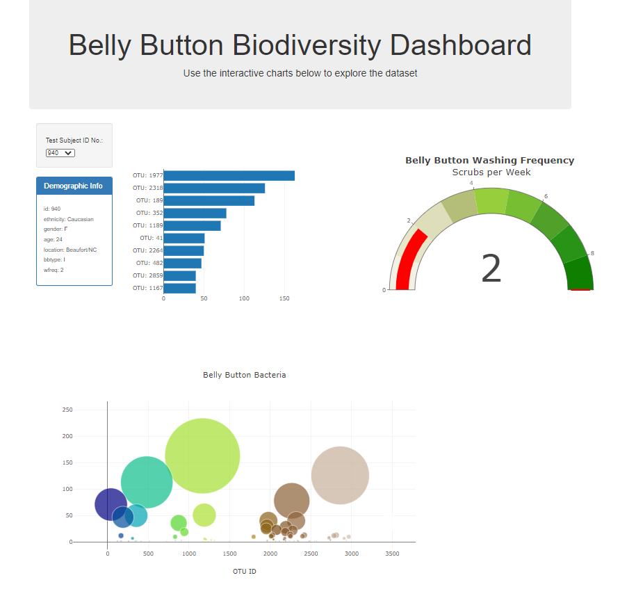

# plotly_deploy

# Module 12 Challenge
In Module 12, we learned how to apply JavaScript and HTML to create an interactive webpage to extract data from samples.json file using a script. We are to generate a horizontal bar graph of the top 10 out_id in descending order, generate a gauge chart, and generate a bubble chart. Attached is the image of the final results of the webpage. I recommend adding more bootstrap elements to make the webpage more glamorous. For example, we could apply a dark background image by using <class="bg-dark"> to the body tag. If a company is collecting similar data and presenting the information on a webpage, we could also web scrape the information and present it in our index.html. 

## Challenges:
The challenges I faced were extracting data from the "samples" array. I've went into TA's office hours and asked questions in Slack for help from other classmates. For example, my code would be:
```var x = ["sample_values"];```
but the actual code should be adjusted to: ```var x = resultArray[0]["sample_values"];```

## Link to GitHub Pages:
The link to the GitHub Pages: https://rlau929.github.io/plotly_deploy/

## PNG Image of Module 12 Challenge:

